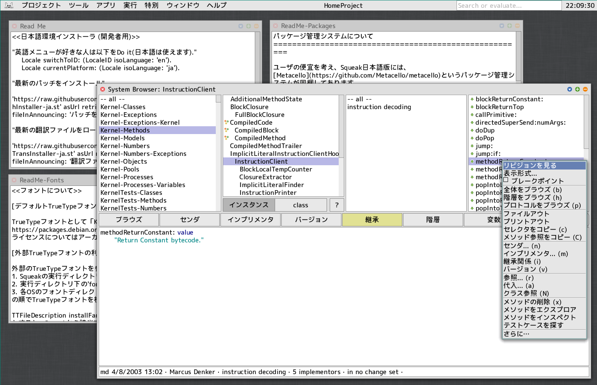

# squeak-ja

[Squeak Smalltalk](https://squeak.org/) 用の日本語化パッチと翻訳リソースです。

## インストール方法

[`installers/InstallJa20260724.sar`](./installers/InstallJa20260724.sar) を、起動中のSqueakの画面にドラッグ&ドロップし、
表示されるメニューから "install SAR" を選んでください。

## フォルダ構成

- `installers/` — エンドユーザ向けの日付入り完成インストーラ (`InstallJa<YYYYMMDD>.sar`)。これをD&Dするだけで日本語化パッチ・翻訳・フォント等一式がインストールされます。
- `installerBuild/` — インストーラ一式のビルド用ステージング領域(フォント、パッケージ/フォントユーティリティ、Squeak上で表示されるReadMe類など)。
- `patches/` — リリース済みパッチアーカイブ (`.sar`) と、Squeakバージョンごとの一覧ファイル (`PatchList<version>-ja.txt`)、リモートインストール用の `PatchInstaller-ja.st`。
- `patches-source/<version>/` — 各パッチアーカイブの元となるチェンジセット等のソース一式。
- `translations/` — 日本語UI翻訳の元データ (`trans.tsv`)、生成された翻訳ファイル (`ja-<date>.translation`)、バージョンごとの一覧ファイル、リモートインストール用の `TransInstaller-ja.st`。
- `docs/` — スクリーンショットなどのドキュメント資産。
